<div align="center">

<!-- Animated Banner -->


<!-- Typing SVG -->
<a href="https://git.io/typing-svg">
  
</a>

<br/>


&nbsp;
<a href="https://github.com/deepshekhardas?tab=followers">
  
</a>

</div>

---

## 🧑‍💻 About Me

```javascript
const deepshekhar = {
  name     : "Deepshekhar Das",
  location : "Lucknow, Uttar Pradesh 🇮🇳",
  role     : "Full-Stack Developer & Open Source Contributor",
  current  : ["Building AI Agent Swarm Systems 🤖",
              "Shipping Quality PRs Daily 📦",
              "Learning in Public 📢"],
  goal     : "8000+ Quality Open Source PRs 🎯",
  dailyRoutine: "Code → PR → Repeat (10h+/day) ⚡",
  funFact  : "I treat every PR like a product launch 🚀",
};
```

---

## 🛠️ Tech Stack

<div align="center">

**Languages & Runtimes**


**Frameworks & Libraries**


**AI & Tools**


</div>

---

## 📊 GitHub Stats

<div align="center">


&nbsp;


<br/>


</div>

---

## 🏆 GitHub Trophies

<div align="center">
     

---

## 🎯 Current Focus

<table align="center">
<tr>
<td width="50%">

### 🤖 Building
- Autonomous AI Agent Systems
- Multi-Agent Swarm Architectures
- AI-powered Web Automation Tools
- Full-Stack SaaS Products

</td>
<td width="50%">

### 📚 Learning
- Advanced LLM Prompt Engineering
- Voice Agents & Multimodal AI
- Enterprise App Architecture
- Business Automation at Scale

</td>
</tr>
</table>

---

## 🐍 Contribution Graph

<div align="center">

</div>

---
## 🔥 Open Source Mission

<div align="center">

> *"Every PR is a step toward mastery. Consistency beats intensity — ship daily, learn forever."*


---

## 📬 Connect With Me

<div align="center">

[](https://linkedin.com/in/deepshekhardas)
[](https://github.com/deepshekhardas)
[](https://twitter.com/deepshekhardas)
[](mailto:deepshekhardas@gmail.com)

</div>

---

<div align="center">


**⚡ "Code. Commit. Conquer." ⚡**

*Made with ❤️ from Lucknow, India 🇮🇳*

</div>
